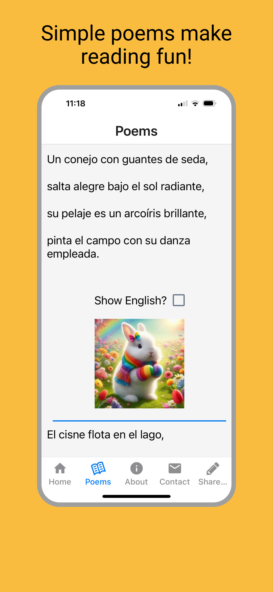
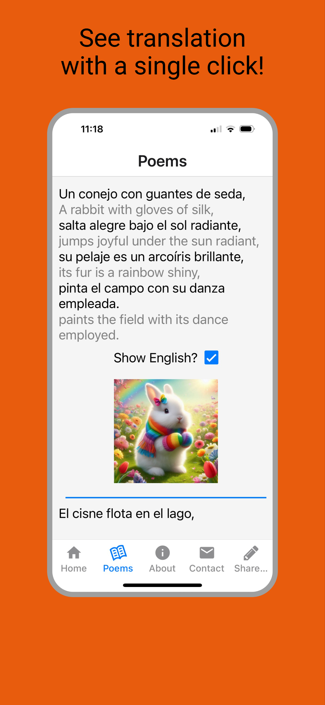

# Welcome to VerseHint

The best way to practice learning Spanish using poetry and instant translation. 
Discover the joy of language learning through poetry with Verse Hint, the app that turns rhyming verses into an engaging way to build your language skills.

---

[Get the App on the Apple App Store](https://apps.apple.com/us/app/spanish-poems/id6739074042 )  

 

## Why VerseHint?

### Learn Through Rhyme
Poetry isn’t just beautiful—it’s memorable. Rhyming poems help reinforce vocabulary and pronunciation in ways that stick.

### Make Reading Fun
Verse Hint keeps you motivated with its interactive reading experience.  With a single click, you can see a literal translation that helps you learn new vocabulary and quickly get back to reading.

### Overcome the Intermediate Plateau
Break free from the monotony of traditional language learning methods. With Verse Hint, you’ll enjoy meaningful content that bridges the gap between beginner and fluent reading.

| Without Translation      | With Instant Translation |
| ----------- | ----------- |
| | |

---

## Get in Touch
Have questions or feedback? We’d love to hear from you! Visit our [Contact Page](https://forms.gle/5XrmBxbyZ7f1HqvM9) to connect with us.

---

Experience the power of VerseHint and transform your language-learning journey today!

## Privacy Policy
[Privacy](privacy.md)
